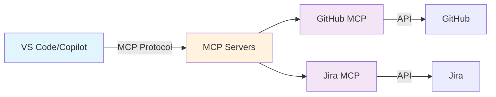

# MCP Server Integration for GitHub & Jira

[](https://www.docker.com/)
[](https://modelcontextprotocol.io/)
[](https://opensource.org/licenses/MIT)

Transform your development workflow with MCP (Model Context Protocol) servers that seamlessly connect GitHub Copilot to your GitHub and Jira instances. Reduce context switching by 70% and triple your productivity.

## 🎯 What This Solves

- **Context Overload**: Automatically loads issue context without manual copying
- **Repetitive Tasks**: Automates PR creation, ticket updates, and documentation
- **Mental Fatigue**: Preserves cognitive bandwidth for actual problem-solving
- **Multi-Tool Friction**: Unifies GitHub and Jira workflows through natural language

## 🚀 Quick Start

### Prerequisites
- Docker installed and running
- GitHub Personal Access Token ([Create one](https://github.com/settings/personal-access-tokens/new))
- Jira API Token (for Jira integration)
- VS Code 1.101+ with GitHub Copilot

### One-Click Setup

1. Clone the repository:
```bash
git clone https://github.com/yourusername/mcp-server-integration
cd mcp-server-integration
```

2. Create environment file:
```bash
cat > ~/.mcp/.env << EOF
GITHUB_PERSONAL_ACCESS_TOKEN=ghp_your_token_here
JIRA_PERSONAL_TOKEN=your_jira_token
JIRA_URL=https://your-domain.atlassian.net
EOF
```

3. Add to VS Code settings.json:
```json
{
  "chat.mcp.enabled": true,
  "mcp": {
    "servers": {
      "github": {
        "command": "docker",
        "args": [
          "run", "-i", "--rm",
          "--env-file", "${HOME}/.mcp/.env",
          "-e", "GITHUB_PERSONAL_ACCESS_TOKEN",
          "ghcr.io/github/github-mcp-server"
        ]
      },
      "jira": {
        "command": "docker",
        "args": [
          "run", "-i", "--rm",
          "--env-file", "${HOME}/.mcp/.env",
          "-e", "JIRA_URL",
          "-e", "JIRA_PERSONAL_TOKEN",
          "ghcr.io/sooperset/mcp-atlassian:latest"
        ]
      }
    }
  }
}
```

4. Enable Agent Mode in GitHub Copilot Chat and start using!

## 📋 Features

### GitHub MCP Server
- 📁 **Repository Management**: Browse code, search files, analyze commits
- 🐛 **Issue & PR Automation**: Create, update, manage issues and PRs
- 🔄 **CI/CD Intelligence**: Monitor Actions, analyze failures
- 🔒 **Security Scanning**: Review security findings and Dependabot alerts

### Jira MCP Server
- 📝 **Smart Issue Updates**: Natural language ticket updates
- 🔍 **Context Loading**: Auto-fetch issue details into AI context
- 🏷️ **Project Navigation**: Search and filter issues across projects
- 🔗 **Cross-Reference**: Link PRs to tickets automatically

## 🏗️ Architecture


### Core Components

| Component | Description | Technology |
|-----------|-------------|------------|
| **Transport Layer** | Stdio/HTTP communication | JSON-RPC |
| **Authentication** | PAT/OAuth token management | Environment variables |
| **Tool Registry** | Modular tool organization | Go interfaces |
| **API Clients** | Service-specific wrappers | REST/GraphQL |
| **Container Runtime** | Isolated execution | Docker Alpine |

## ⚙️ Configuration

### Environment Variables
```bash
# GitHub Configuration
GITHUB_PERSONAL_ACCESS_TOKEN=ghp_xxxx
GITHUB_HOST=https://github.com  # Or your enterprise URL
GITHUB_TOOLSETS=repos,issues,pull_requests,actions
GITHUB_READ_ONLY=false  # Set true for safe mode

# Jira Configuration
JIRA_URL=https://your-domain.atlassian.net
JIRA_PERSONAL_TOKEN=xxxx
JIRA_SSL_VERIFY=true
```

### Toolset Management

Enable only what you need for better performance:
```bash
# Minimal setup
GITHUB_TOOLSETS="context,repos,issues"

# Full setup
GITHUB_TOOLSETS="all"

# Dynamic discovery (recommended)
GITHUB_DYNAMIC_TOOLSETS=1
```

### Available Toolsets

| Toolset | Description | Tools Included |
|---------|-------------|----------------|
| `context` | User profile & teams | get_me, get_teams |
| `repos` | Repository operations | create_branch, get_commits, search_code |
| `issues` | Issue management | create_issue, update_issue, add_comment |
| `pull_requests` | PR workflows | create_pr, merge_pr, request_review |
| `actions` | CI/CD operations | run_workflow, get_logs, list_runs |
| `code_security` | Security scanning | get_alerts, list_vulnerabilities |

## 💡 Usage Examples

### Load Jira Context
```
"Include context from JIRA-1234"
```
Copilot automatically fetches issue details and related information.

### Create PR with Context
```
"Create a PR for the changes we discussed, linking to JIRA-1234"
```
Generates PR with description, links issue, and updates Jira.

### Search and Fix Issues
```
"Find all critical bugs in the auth module and suggest fixes"
```
Searches issues, analyzes code, and proposes solutions.

### Analyze CI Failures
```
"Why did the last deployment fail?"
```
Retrieves workflow logs, identifies errors, suggests fixes.

## 🔒 Security Best Practices

1. **Token Management**
   - Never commit tokens to version control
   - Use minimal required scopes
   - Rotate tokens regularly
   - Store in secure environment files

2. **Access Control**
   - Use read-only mode for exploration
   - Limit toolsets to required functions
   - Review agent actions before confirmation

3. **Network Security**
   - Use HTTPS for all connections
   - Verify SSL certificates
   - Restrict to allowed domains only

## 📊 Performance Impact

| Metric | Before MCP | After MCP | Improvement |
|--------|------------|-----------|-------------|
| Context Loading | 45% of time | 5% of time | 90% reduction |
| Issue Resolution | 2-3 hours | 30-45 mins | 75% faster |
| Daily Throughput | 2-3 issues | 8-10 issues | 3-4x increase |
| Documentation | 20% of time | Automated | 100% automated |

## 🤝 Contributing

We welcome contributions! See [CONTRIBUTING.md](CONTRIBUTING.md) for guidelines.

### Development Setup
```bash
# Build from source
go build -o mcp-server cmd/server/main.go

# Run tests
go test ./...

# Build Docker image
docker build -t mcp-server:local .
```

### Adding New Tools

1. Define tool in `tools/` directory
2. Add to appropriate toolset
3. Update parameter schemas
4. Add tests
5. Submit PR

## 📚 Documentation

- [Installation Guide](docs/INSTALL.md)
- [Configuration Reference](docs/CONFIG.md)
- [Tool Catalog](docs/TOOLS.md)
- [Troubleshooting](docs/TROUBLESHOOTING.md)
- [API Reference](docs/API.md)

## 🐛 Troubleshooting

### Common Issues

| Issue | Solution |
|-------|----------|
| "Connection refused" | Ensure Docker is running |
| "Authentication failed" | Check token permissions and expiry |
| "Tool not found" | Enable required toolset |
| "Rate limit exceeded" | Implement caching or reduce frequency |

### Debug Mode
```bash
# Enable verbose logging
MCP_VERBOSE=true docker run ...

# Test connection
docker run --rm ghcr.io/github/github-mcp-server --test
```

## 📈 Roadmap

- [ ] GitLab MCP server support
- [ ] Slack integration
- [ ] Linear.app support
- [ ] Custom tool builder UI
- [ ] Performance analytics dashboard
- [ ] Multi-workspace management
- [ ] Terraform/IaC integrations

## 🙏 Acknowledgments

- [Anthropic](https://anthropic.com) for the MCP protocol
- [GitHub](https://github.com) for the official MCP server
- Community contributors and testers

## 📄 License

MIT License - see [LICENSE](LICENSE) file

## 🔗 Links

- [Blog Post](https://yourblog.com/mcp-integration)
- [MCP Protocol Docs](https://modelcontextprotocol.io)
- [GitHub MCP Server](https://github.com/github/github-mcp-server)
- [Community Discord](https://discord.gg/mcp)

## ⭐ Star History

[](https://star-history.com/#yourusername/mcp-server-integration&Date)

---

**Built with ❤️ for the developer community**

*If this helped your workflow, please star ⭐ the repo and share your experience!*
